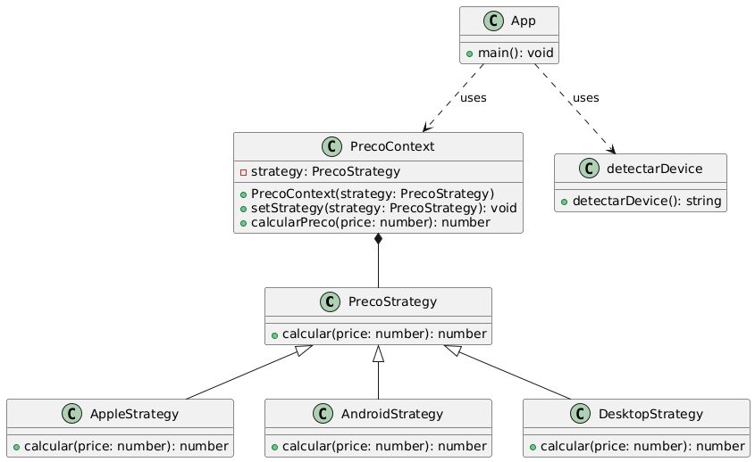

# Exemplo de preço com o padrão estrategy

Este repositório contém uma implementação do padrão de projeto Strategy em JavaScript, aplicada a um exemplo de precificação dinâmica com base no dispositivo do usuário.
(outras branches desse projeto contém outros exemplos)

## O que é o Padrão Strategy?

O padrão Strategy é um padrão comportamental que permite que uma família de algoritmos seja definida e encapsulada em classes separadas, tornando-os intercambiáveis. Este padrão permite que o algoritmo varie independentemente dos clientes que o utilizam, tornando o código mais flexível e fácil de manter.

### **Vantagens do Padrão Strategy:**

- **Flexibilidade:** Permite a alteração dos algoritmos em tempo de execução sem alterar o código cliente.
- **Manutenção:** Facilita a manutenção do código ao separar a lógica do algoritmo em classes distintas.
- **Reutilização:** Os algoritmos encapsulados podem ser reutilizados em diferentes contextos.

## Implementação no Projeto

Neste exemplo, o padrão Strategy é utilizado para calcular o preço de um produto com base no dispositivo que o usuário está utilizando:

- **AppleStrategy:** Adiciona 5% ao preço se o dispositivo for da Apple (iPhone, iPad, Mac).
- **AndroidStrategy:** Aplica um desconto de 5% se o dispositivo for um celular Android ou similar.
- **DesktopStrategy:** Mantém o preço original se o dispositivo for um desktop.

### **Arquitetura do Projeto**

- **index.html:** Página HTML que exibe o preço original e o preço final calculado.
- **app.js:** Script principal que detecta o dispositivo e aplica a estratégia de preço correspondente.
- **PrecoStrategy.js:** Define a interface da estratégia de preços.
- **AppleStrategy.js, AndroidStrategy.js, DesktopStrategy.js:** Implementam estratégias de preços específicas para cada tipo de dispositivo.
- **Context.js:** Contexto que utiliza a estratégia para calcular o preço.
- **detectarDevice.js:** Função para detectar o dispositivo do usuário com base no `userAgent`.

### **Estrutura dos Arquivos**

```plaintext
.
├── index.html
├── js/
│   ├── app.js
│   ├── Context.js
│   ├── detectarDevice.js
│   ├── devices/
│   │   ├── AndroidStrategy.js
│   │   ├── AppleStrategy.js
│   │   └── DesktopStrategy.js
│   └── PrecoStrategy.js
```
## Como Funciona
- Detecção de Dispositivo: O arquivo detectarDevice.js detecta o dispositivo do usuário através do userAgent.
- Escolha da Estratégia: Com base no dispositivo detectado, o app.js escolhe a estratégia de precificação apropriada.
- Cálculo do Preço: O preço final é calculado usando a estratégia selecionada e exibido na página HTML.



## Exemplo de Uso

```bash
import { AndroidStrategy } from './devices/AndroidStrategy.js';
import { AppleStrategy } from './devices/AppleStrategy.js';
import { DesktopStrategy } from './devices/DesktopStrategy.js';
import { detectarDevice } from './detectarDevice.js';
import PrecoContext  from './Context.js';

const originalPrice = 100.00; 
const deviceType = detectarDevice(); 

const dispositivo ={
    Apple : new AppleStrategy(),
    Mobile : new AndroidStrategy(),
    Desktop : new DesktopStrategy()
}

let strategy;

strategy = dispositivo[deviceType];

const contextodopreco = new PrecoContext(strategy);
const finalPrice = contextodopreco.calcularPreco(originalPrice);

document.getElementById('final-price').textContent = `R$${finalPrice.toFixed(2)}`;
```
## Importância e Usabilidade
O padrão Strategy é extremamente útil em cenários onde diferentes algoritmos ou comportamentos precisam ser aplicados em diferentes situações, como no caso deste exemplo de precificação dinâmica. A separação clara dos algoritmos em classes distintas permite fácil manutenção e escalabilidade do código, especialmente em aplicações complexas.

Além disso, o Strategy pode ser aplicado em diversas outras áreas, como validação de formulários, renderização de componentes, e autenticação de usuários, demonstrando sua versatilidade e importância em desenvolvimento de software moderno.
